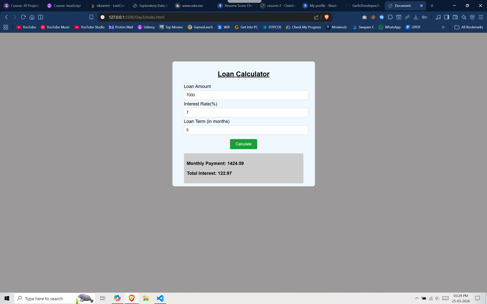

#  Loan Calculator

Day 3 of my **1 Project Per Day Challenge**

A simple and interactive **Loan Calculator** built using HTML, CSS, and JavaScript. It helps users calculate monthly EMI and total interest based on loan amount, interest rate, and loan duration.

---

##  Features
- Input loan amount, interest rate, and loan term
- Calculates **Monthly EMI**
- Displays **Total Interest**
- Clean and responsive UI

---

##  Tech Stack
- HTML
- CSS
- JavaScript

---

##  Output



---

##  How to Run
1. Clone the repository  
   ```bash
   git clone https://github.com/GarlicDeveloper/loan-calculator.git
